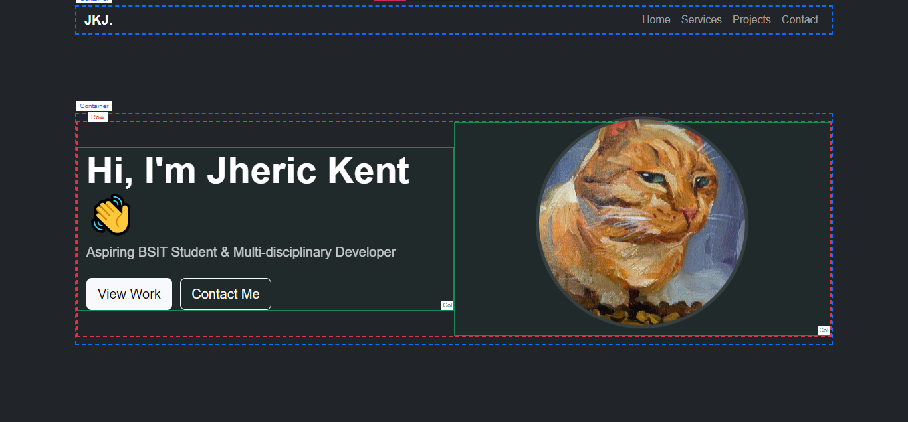
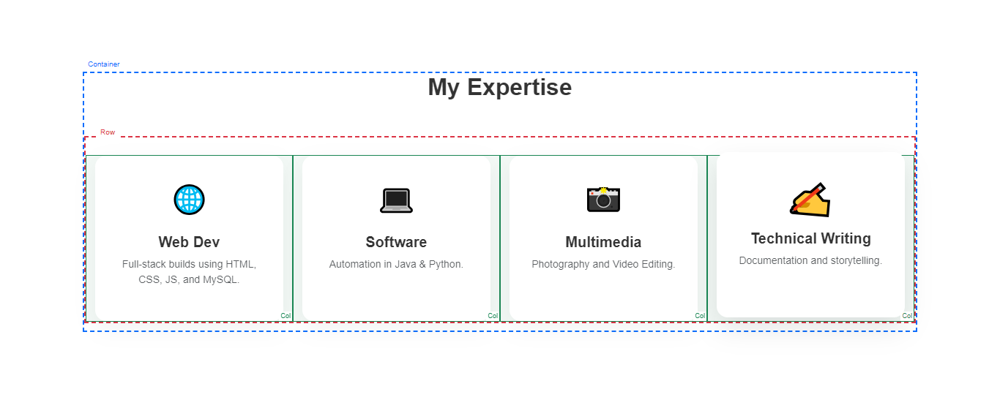
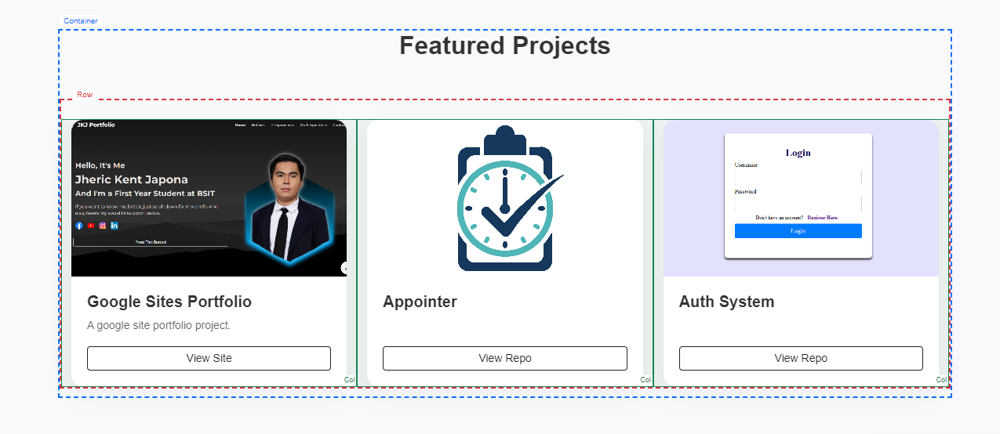
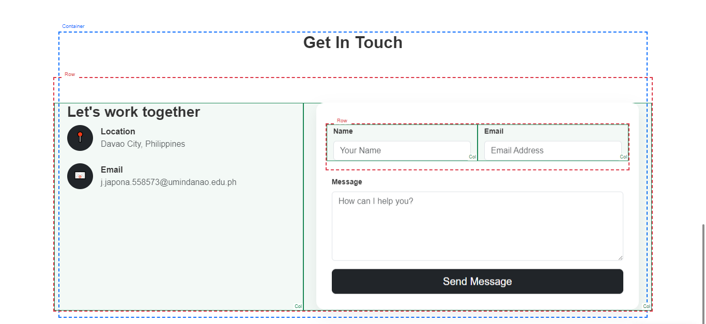

# 🚀 Documentation

This document provides a detailed, line-by-line explanation of every technical component used in the project for future reference and learning.

---

## 📚 1. Comprehensive Bootstrap 5 Breakdown

Bootstrap 5 is a utility-first CSS framework. Here is a breakdown of every class used in the HTML:

### A. Layout & Grid System
The core of Bootstrap is its 12-column flexbox grid.
* **`.container`**: Centers the content on the page and provides responsive `max-width` at each breakpoint. It prevents the content from touching the screen edges.
* **`.row`**: A wrapper that creates a flexbox context for columns. It uses negative margins to counteract the padding of columns, ensuring perfect alignment.
* **`.col-md-6 / .col-lg-5 / .col-sm-6`**: 
    * **Logic**: Bootstrap divides the screen into 12 units. `.col-md-6` means the element takes up 6 units (50% of the screen) on "Medium" devices (tablets) and larger. 
    * **Stacking**: On mobile, these automatically stack to 12 units (100% width) unless a small class like `.col-sm-6` is used.
* **`.g-4` & `.g-5`**: "Gutter" classes. These manage the vertical and horizontal "gap" between columns in a grid.

### B. Navigation & Header
* **`.navbar`**: The base class for the navigation component.
* **`.navbar-expand-lg`**: A responsive utility that keeps the menu items visible on large screens but collapses them into a "hamburger" menu on smaller devices.
* **`.fixed-top`**: Sets `position: fixed` and `top: 0`, pinning the navigation bar to the top of the browser during scrolling.
* **`.navbar-dark` & `.bg-dark`**: Styles the navbar text to be light (for accessibility) and the background to Bootstrap's standard dark hex code.

### C. UI Components & Forms
* **`.btn`, `.btn-light`, `.btn-dark`, `.btn-outline-light`**:
    * **`.btn`**: Sets base padding, border-radius, and font settings.
    * **`.btn-outline-light`**: Removes the solid background, making the button transparent with a border until hovered.
* **`.card` & `.card-img-top`**: Creates a flexible content container. `.card-img-top` ensures the image fits the top corners of the card without overlapping the rounded borders.
* **`.form-control`**: Applied to `<input>` and `<textarea>`. It removes the ugly default browser styling and adds a modern focus state, full width, and rounded corners.

### D. Utility Classes (Shorthand)
* **Spacing**: `.mb-5` (Margin-Bottom), `.mt-4` (Margin-Top), `.py-4` (Padding-Vertical: Top and Bottom).
* **Typography**:
    * **`.display-4`**: A large, fluid heading style used for the main Hero title.
    * **`.lead`**: Increases the font size and reduces the weight of a paragraph for better readability.
    * **`.text-muted`**: Dims the text color to grey, creating a visual hierarchy for secondary information.
* **Flexbox**: `.ms-auto` (Margin-Start-Auto) uses flexbox to push navigation items to the right side of the bar.

---

## 🎨 2. Custom CSS & Logic Explanation

Where Bootstrap provides the "skeleton," custom CSS provides the "personality." Here is a deep dive into the custom styles:

### A. Global Site Behavior
* **`scroll-behavior: smooth`**: Enables the browser's native smooth-scroll feature. When clicking "Contact," the page slides down instead of jumping instantly.
* **`scroll-margin-top: 70px`**: Because the Navbar is `fixed-top`, it "floats" above the page. This property adds a 70px "buffer" to every section title so they don't get hidden behind the menu when you navigate.

### B. Interactive Animations
* **`@keyframes bobbing`**: A custom animation sequence. By using `translateY(-10px)` at the 50% mark, the image appears to float up and down.
* **`animation-play-state: paused`**: Linked to the `:hover` state. It stops the floating animation when the user's mouse is over the profile picture, making it easier to see.
* **`.fs-1` (Emoji Animation)**: We added a `transition: transform 0.3s` to the icons. On hover, the icon uses `scale(1.2) rotate(5deg)`, providing a "pop-out" effect that feels interactive and modern.

### C. The "Custom Card" System
* **`box-shadow: 0 10px 30px rgba(0, 0, 0, 0.05)`**: This overrides the flat look of Bootstrap. It creates a soft "floating" shadow.
* **`transform: translateY(-5px)`**: When a user hovers over any card, it moves slightly upward. This "lifts" the card, signaling to the user that it is an interactive element.

### D. Responsive Design Tweaks
* **`@media (max-width: 767px)`**: These are custom mobile overrides. 
    * We shrink the Hero image to `70%` width so it doesn't overwhelm the phone screen.
    * We use `display: block` and `margin: 0 auto` to center the image once the columns stack vertically.

### E. Advanced Image Handling
* **`object-fit: cover`**: This is a critical property for professional web design. It ensures that images (like project screenshots) fill their assigned `200px` height without being stretched, squashed, or distorted, regardless of their original aspect ratio.

---

## 🛠️ 3. Visual Layout Debugging (The "Invisible Boxes")

To master the grid, I visualized a **Debug Mode** that reveals the underlying architecture of the site. Below are the visual representations of how Bootstrap's "invisible boxes" are structured across different sections.

### Section Architecture
* **Blue Outlines**: `.container` (Responsive width controller)
* **Red Outlines**: `.row` (The flexbox wrapper)
* **Green Outlines**: `.col-*` (The individual grid units)

#### 🏠 Home Section

*Logic:* Shows the `.align-items-center` class perfectly centering the text and the profile image vertically.

#### 🛠️ Services Section

*Logic:* Visualizes the `.g-4` gutter spacing between the four `.col-md-3` expertise cards.

#### 📁 Projects Section

*Logic:* Demonstrates how `.col-md-4` breaks the 12-unit grid into three equal parts.

#### 📧 Contact Section

*Logic:* Shows the asymmetrical grid using `.col-lg-5` for info and `.col-lg-7` for the contact form.

---

## 🚀 Final Summary
This project represents a hybrid approach to web development:
1. **Bootstrap 5** handles the heavy lifting of responsive layout and grid logic.
2. **Custom CSS** adds the unique visual polish, animations, and UX refinements that make the portfolio stand out.

---
© 2026 Jheric Kent Japona | Web Development Documentation